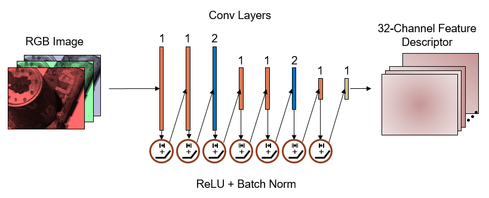
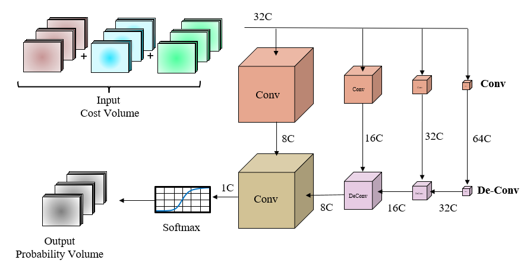

## CS231A: Computer Vision (Reconstruction and Recognition) 
Programmer: Bradley Collicott

A PyTorch implementation of the MVSNet deep learning pipeline for multi-view stereo reconstruction.

## Final Project: End-to=End Deep Learning for Multi-View Stereo
This project aims to reproduce the network and results of the [MVSNet](https://arxiv.org/pdf/1804.02505.pdf). The goal of this project is to train a neural network to output the depth map of a scene given a reference image and several overlapping auxiallary images. The general structure of the problem is shown below:

     

## Neural Network Components

### Feature Extraction Network

The first component of the depth estimation process is extracting deep features using an 8-layer convolutional neural network. The each input RGB image is reduced to 1/4 of it's original height and width and expanded to 32 channels.

     

### Cost Volume Regularization Network

The feature maps are warped into the viewing plane of the reference camera at varying depths and aggregated into a single cost volume. This cost volume is regularized using an encoder-decoder style 3D convolutional network and output as a probability volume using a single softmax layer.

     

### Depth Refinement Network

The probability volume from the previous step is used to compute the expected depth of each pixel. This initial depth map is refined by convolving it with the reference image to learn a "depth residual". The learned residual is added to the original depth map to produce the refined depth map.

     

## Training

### Dataset
The network is trained on 5000+ samples from the [DTU MVS dataset](https://roboimagedata.compute.dtu.dk/?page_id=36) for 10 epochs. Each sample contains 3 input images, the ground truth depth map of the reference image, and the camera intrinsic/extrinsic parameters for each view.

### Loss
The loss function captions depth estimation error in both the intial and the refined depth maps. The total loss is computed as the sum of the mean absolute error of each depth map per mini-batch.
